<h1 align="center">
  
  <br>
  Refund
</h1>

<p align="center">
  
  
</p>

<p align="center">
  
</p>

## 💻 About the Project

**Refund** is a web application designed to simplify the management of reimbursement requests. The system allows users to register expenses, categorize them efficiently, and view the total amount to be refunded in real-time.

The interface is clean, responsive, and user-friendly, ensuring a smooth experience when managing financial records.

## ✨ Features

- **Expense Registration:** Add expenses with a name, category, and amount.
- **Category Selection:** Organize expenses by types such as:
  - 🍔 Food
  - 🏨 Accommodation
  - 🛠️ Services
  - 🚗 Transport
  - 📦 Others
- **Real-time Calculation:** The total refund amount updates automatically as items are added or removed.
- **Input Masking:** Currency input is automatically formatted to BRL (R$) standards while typing.
- **Responsive Design:** Layout adapts to different screen sizes (Desktop and Mobile).

## 🚀 Technologies

This project was developed with the following technologies:

- **HTML5** (Semantic structure)
- **CSS3** (Styling and layout)
- **JavaScript** (DOM manipulation and logic)
- **Google Fonts** (Open Sans)

## 📂 How to Run

1. Clone this repository:
   ```bash
   git clone https://github.com/AndrePassoni/Refund.git
   ```
2. Navigate to the project directory:
   ```bash
   cd Refund
   ```
3. Open the `index.html` file in your browser:
   - You can simply drag and drop the file into a browser tab.
   - Or use an extension like **Live Server** in VS Code.

## 🎨 Layout

The application features a sidebar (or bottom section on mobile) that lists all added expenses and calculates the sum dynamically. Users can remove items by clicking the trash icon.

## 📝 License

This project is under the MIT license. See the [LICENSE](LICENSE) file for more details.

---

<p align="center">
  Made with 💜 by <a href="https://github.com/AndrePassoni">André Passoni</a>
</p>